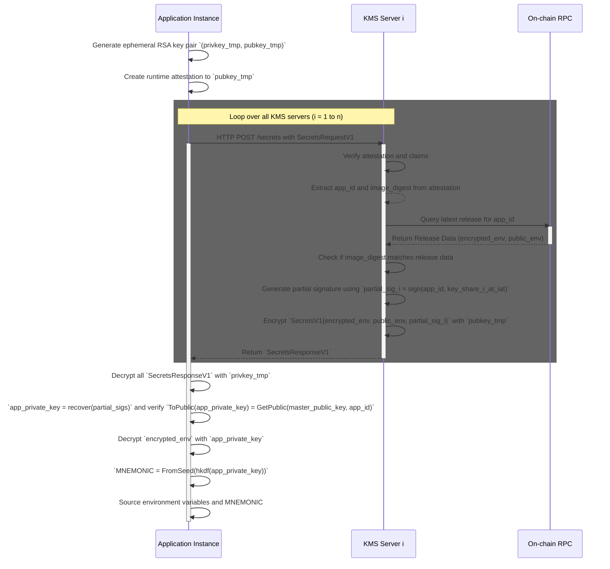

# New KMS

# Purpose

The purpose of this document is to propose a new design for the EigenX KMS. Clearly, our existing KMS leaves much to be desired as clearly enumerated in [the documentation](https://github.com/Layr-Labs/eigenx-kms/blob/master/kms.md#limitations-of-the-mvp).

This design aims to address the most glaring flaw in the KMS design, which is that it requires trust in EigenLabs' cloud admins in order to prevent access to signing/decryption capabilities.

In particular, these issues:
> - The cloud admin has access to signing/decreption with them for the MVP. Eventually, a new set of keys will be generated and moved to an external system that is hardened that will also enable encryption/decryption and key derivation.
> - The KMS trusts the RPC it's configured with to serve the correct release events.

Restating the desired properties of a KMS,
> - Only the latest onchain whitelisted code for a given application has access to its secrets and private keys.
> - The latest onchain whitelisted code for a given application always has access to its secrets and private keys, even in the case of a major operational failure.

In addition, we would like to take as few one way doors as possible (no cloud provider lock in, technology lock in, etc.) and have keys be migrateable across the various systems we may develop over time.

We propose that the best way to solve these problems and evolve the KMS is to recruit a decentralized set of operators to run a distributed, key-shared KMS as an EigenLayer AVS.

# Overview (claude)

The EigenCompute KMS AVS operates as a distributed key management system where 20-30 operators collectively maintain key shares of a master secret key through threshold cryptography. Operators run a Distributed Key Generation (DKG) protocol to establish a shared `master_public_key` on BLS12-381, with the corresponding `master_secret_key` split into shares distributed across all nodes. These key shares are automatically refreshed every 10 minutes through a resharing protocol to accommodate operator set changes. When an application instance needs access to its secrets, it generates a runtime attestation proving it's running authorized code, then requests partial key signatures from all KMS servers. Each KMS server verifies the attestation against on-chain release data, and if valid, returns its partial signature encrypted with the application's ephemeral public key. The application collects responses from at least ⌈2n/3⌉ servers, reconstructs its `app_private_key` through threshold signature recovery, verifies it against the public master key, and uses it to decrypt its environment variables and derive a deterministic mnemonic.

For third parties to know the addresses of a given application, which requires complex cryptographic operations on the private key itself, a separate AddressAPI service runs in Google Confidential Spaces with special privileges to retrieve any application's private key from the KMS. This service derives blockchain addresses (5 EVM and 5 Solana addresses per application) through the same attestation-based key retrieval flow, with its operations verifiable through runtime attestations to ensure it's running the protocol-enshrined reproducibly-built image.

This architecture ensures that only attested code running the latest on-chain whitelisted version can access secrets, while requiring a supermajority of operators to collude for any security breach.

# Specification

## Definitions

Workload operator refers to the cloud provider AND owner of the cloud account in which application instances are running.

## Parameters

| Name | Explanation | Value |
|-----|------|------|
| `KMS_THRESHOLD` | The threshold of KMS nodes needed to recover the `master_secret_key` or any application's decryption key | ⌈2n/3⌉ (n = number of nodes) |
| `RESHARE_FREQUENCY` | The frequency at which new keys shares are generated and reshared by KMS nodes | 10 minutes |

## EigenLayer AVS

An EigenLayer AVS utilizing MiddlewareV2 will be deployed as the "EigenCompute KMS AVS". The AVS will utilize:

- an allowlist and ejection owned by governance.
- ed25519 as the key type. `p2p_pubkey`s will be used for authenticating p2p communications and communications with application TEEs from KMS nodes. These will need to be added to the KeyRegistry EigenLayer core contract.
- a version of the socket registry that allows operators to set their `p2p_node_url` to be utilized for p2p communications and `kms_server_url` to be utilized for communications with application TEEs.

We anticipate 20-30 nodes in this operatorSet.

```solidity
interface IKmsAvsRegistry {
    struct NodeInfo {
        bytes pubkey;
        string p2pNodeUrl;
        string kmsServerUrl;
    }
}
```

EIGEN stake?

## DKG & Reshares

A DKG is is run between all registered nodes to initialize a `master_public_key` (on BLS12-381) that is key-shared between all nodes. During the key generation, nodes manually (via CLI) generate signatures over `master_public_key` with their `p2p_pubkey` and post them onchain. Nodes talk over an all2all `p2p_pubkey` encrypted p2p network.

```solidity
interface IKmsAvsRegistry {
    /// @notice returns the p2pPubkey, p2pNodeUrls, and kmsServerUrls for every node
    function getNodeInfos() returns(OperatorInfo[] memory)
}
```

In addition, the corresponding `master_secret_key` is reshared among all nodes at a `RESHARE_FREQUENCY`. Every reshare, nodes look onchain via `getNodeInfos` to see if there are any new or removed nodes for the KMS AVS. When reshares fail, the key shares remain the same until the next successful reshare.

DKG+Reshares are provided out of the box by commonware's libraries. The main effort from our end will be hooking up the smart contract integration and getting this run in a distributed setting across a bunch of operators. Their implementation requires no central party to run the DKG.

## Application Decryption & Mnemonic Generation

```rust
struct SecretsRequestV1 {
    attestatation: GoogleCSAttestation,
    rsa_pubkey_tmp: RSAPubkey,
}
struct SecretsResponseV1 {
    encrypted_env: String,
    public_env: String,
    encrypted_partial_sig: String,
}
```



Applications must be able decrypt their environment file and any other secrets and deterministically generate their mnemonic. In order to do this, applications are provided a list of `KMS_SERVER_URLS` through an overriden environment variable from the workload operator (EigenLabs). They then loop through each of these server URLs and make a request to each of them with a runtime attestation to the public key which responses should be encrypted with.

The KMS servers then verify the attestation and make sure that the application is running the code that is specified onchain. If so, they generate their share of the app's decryption key, which is simply their signature on the app_id with their `master_secret_key` key share at the time at which the attesation was issued. This forces consistency between key shares used for secret responses during reshares. They then encrypt the environment files and the decryption key share with the app instance's specified RSA public key and send it back the the app instance.

The app then decrypts the response with its ephemeral RSA private key. It makes sure that at least `KMS_THRESHOLD` of the KMS server responses returned the same environment files and then combines those consistent responses to get its own `app_private_key`. It verifies this `app_private_key` against the `master_public_key` that is baked into the application docker image at build time.

Then it decrypts its encrypted environment file with `app_private_key` and derives a mnemonic from its `app_private_key` deterministically using a HKDF. It sources these the decrypted environment variables, then the MNEMONIC, then the public environment variables and proceeds with the application container logic.

To analyze where this could go wrong:

1. Workload operator provides an application with an incorrect set of `KMS_SERVER_URLS`: This can at most cause a liveness issue which can be solved by eventually putting attestations onchain. The workload operator cannot pull off a man-in-the-middle attack since all information sent from the application to KMS servers is public and information sent from KMS servers to the application is encrypted with a public key whose private key is held within the application TEE. The workload operator may route requests to a bunch of servers they control in which case, validation will fail in case (2).
2. More than `KMS_THRESHOLD` of the KMS servers return an incorrect partial key share: This can at most cause a liveness issue since the application will reconstruct `app_private_key` that is inconsistent with `master_public_key`, which will cause the application to exit.
3. There is no `KMS_THRESHOLD` agreement on the environment files: This can at most cause a liveness issue since the application will notice there is no threshold agreement and then exit.
4. There is `KMS_THRESHOLD` agreement on an incorrect environment file: Given those same servers return a valid `app_private_key`, this is a majority malicious event of the KMS AVS and is therefore a safety failure, the application will source the wrong environment variables.
5. `KMS_THRESHOLD` of the KMS nodes' ETH RPCs are compromised: This is a safety failure. KMS node ETH RPCs are in the same trust model of the KMS node. KMS nodes are underwriting their RPC's correctness.

Therefore, this scheme only has safety broken when the KMS is compromised and still trusts the workload operator with liveness.

## Application Encryption & Address Generation

Decryption and mnemonic generation is downstream of encryption and address generation. In order for an appliction to decrypt something it must have been encrypted. In order for an address to send a transaction, an entity must have previously sent it some funds for gas.

It turns out that the encryption key of the application can be computed easily from the onchain `master_public_key` via simple cryptographic operations (see appendix). The addresses are tougher since they require a complex operation to be performed on the `app_private_key`.

```rust
struct AddressRequest {
    app_id: String,
}

struct EVMAddress {
    address: Address,
    path: String,
}

struct SolanaAddress {
    address: SolanaPubkey,
    path: String,
}

struct AddressResponse {
    evm_addresses: EVMAddress[],
    solana_addresses: SolanaAddress[],
}
```

In order to solve it, we plan to have a persistent managed instance group running in Google Confidential Spaces that runs a protocol enshrined AddressAPI contianer that exposes an API for addresses to certain permissioned entities in our infra. Upon creation of a new app, a listener process will request the API with an `AddressRequest` for the new `app_id`. The request will be routed to an instance that will pull the `app_private_key` from the KMS server URLs in the same fashion as described above, and derive 5 EVM and Solana addresses and return them to the process. The process will then stuff these addresses in a database to return to future requesters through the user API. These addresses could be verified by third parties through a runtime attesation from the AddressAPI container. The AddressAPI containers will have their image digest specially whitelisted in the KMS to be able to retrieve private keys for any application. This puts them in the trusted codebase for the entire protocol, which means that this image must be reproducibly built for anyone to be able to trust this container with their secrets.

# FAQ

## What is commonware? Is commonware production ready?

Using [commonware](https://github.com/commonwarexyz/monorepo/), many of these libraries are available out of the box. A detailed POC exists [here](https://github.com/Layr-Labs/eigenx-distributed-kms).

The commonware team plans to optimistically have all modules auditted by November. If we believe that will spill into December and possibly January it may mean that our codebases are auditted at the same time. We can also block on their audit being completed.

It is likely we will be one of the first production dependents of their software. Their team is highly reputable and they have raised a decent amount of money.

## Why build our own network? What other alternatives exist?

The main alternatives that exists to rolling our own DKG/encryption network are [Lit Protocol](https://developer.litprotocol.com/) and [Shutter Network](https://docs.shutter.network/). We choose not to develop with these for a few reasons:

- Shutter Network seems to only enable timestamp based encryption/decryption rather than generalized identity based encryption
- Lit Protocol seems enables EVM contract calls as its most expressive form of access control, meaning we'd need to be able to verify a Google Attestation onchain (maybe this is ok)
- Lit Protocol's [DKG nodes](https://developer.litprotocol.com/security/communicating-with-nodes#active-nodes) are randos that are mostly unheard of
- [Payment](https://developer.litprotocol.com/paying-for-lit/overview) for Lit protocol requires complex setup with acquiring tokens from a faucet and taking a dependency on another blockchain
- Keeping private key material in a system owned by the EigenCompute protocol is much more advantageous than outsourcing it to a seperate protocol which can later migrate its compute platform.
- Creating a decentralized set of nodes responsible for operations in EigenCompute sets us up better for a unified operatorSet that serves more functions in the future.

## Why aren't KMS nodes running in TEEs? What are the implications?

It is primarily a safety decision to not use TEEs. The main risks of running KMS nodes in TEEs is:

1. Any bug that prevented KMS nodes from upgrading or led to key erasure could potentially brick the entire system forever.
2. All KMS nodes will need to run on Google CS (since there is no other substrate for verifiable OS images). This is undesirable since it locks us further into Google CS.

For these reasons (mostly (1)), we believe it's worth it to have a majority trust assumption on KMS nodes.

The implications of running outside of KMS nodes outside of TEEs is that operator firm employees can see and possibly exfiltrate key material. There is nothing preventing them from running any peice of code they want to.

The benefits is that there is far less work needed for safeguarding upgrades and securing the connection between KMS nodes and reading from and writing to Ethereum state.

## How can this go wrong?

Liveness failures (application instance cannot fetch secrets):

1. Workload operator initializes container with wrong set of of `KMS_SERVER_URL`s: This can at most cause a liveness issue which can be solved by eventually putting attestations onchain. The workload operator cannot pull off a man-in-the-middle attack since all information sent from the application to KMS servers is public and information sent from KMS servers to the application is encrypted with a public key whose private key is held within the application TEE. The workload operator may route requests to a bunch of servers they control in which case, validation will fail in case (2).
2. More than `KMS_THRESHOLD` of the KMS servers return an incorrect partial key share: This can at most cause a liveness issue since the application will reconstruct `app_private_key` that is inconsistent with `master_public_key`, which will cause the application to exit.
3. There is no `KMS_THRESHOLD` agreement on the environment files: This can at most cause a liveness issue since the application will notice there is no threshold agreement and then exit.
4. More than `1-KMS_THRESHOLD` KMS servers crash: This can at most cause a liveness issue since there no decryption key can be assembled from less than a threhsold of signatures.

Safety failures (a non whitelisted image can fetch secrets):

1. More than `KMS_THRESHOLD` of KMS node ETH RPCs are compromised (or they simply disregard their ETH RPC): This is a safety failure since it will either enable a container running the incorrect image to retrieve secrets for an application or return the incorrect environment files to the container. KMS node ETH RPCs are in the same trust model of the KMS node. KMS nodes are underwriting their RPC's correctness.
2. More than `KMS_THRESHOLD` of key shares at a certain `RESHARE_FREQUENCY` are compromised: This is a safety failure since `master_secret_key` can be recovered and used to decrypt and derive all secrets. Note that all key shares must be compromised during the same `RESHARE_FREQUENCY` since they're rotated every `RESHARE_FREQUENCY`.

Other issues:

1. The reshare network fails for some reason: This does not cause a liveness failure for secret requests, but prevents operators from joining/leaving the network and key rotation until the next successful reshare.
2. Less than `KMS_THRESHOLD` of key shares are compromised: This does not effect the safety or liveness of the system. Since keys are rotated/reshared often, these key shares are also stale after enough of the previous key shares have been deleted.
3. Operator onchain ECDSA keys are compromised/lost: The operator must be ejected and possibly whitelisted on a new key by governance. If the keys are compromised, a malicious entity may be able to join the network.

# Open Questions

1. How should staking work for the AVS? What about payments?
2. What should the governance structure of the AVS be?
3. How should rotation of `p2p_pubkey` and `p2p_url` work?

# Appendix 1: Distributed Key Generation (DKG) + Reshare

## DKG

The DKG generates a public key in the G2 of BLS12-381 via the following protocol

<div style="text-align: center;">
  
</div>

This is the Joint-Feldman construction from ["Secure Distributed Key Generation for Discrete-Log Based Cryptosystems" (GJKR99)](https://scispace.com/pdf/secure-distributed-key-generation-for-discrete-log-based-2wimopof2p.pdf).

## Reshare

The reshare protocol allows the qualified set $QUAL$ to generate new shares of the same secret $x$ with potentially different participants or threshold. Each qualified participant $P_i \in QUAL$ initiates a new Joint-Feldman protocol where:

1. Each $P_i$ chooses a new random polynomial $f_i'(z)$ of degree $t'$ over $\mathbb{Z}_q$ such that $f_i'(0) = s_i$ (their current secret share from the original DKG).

2. Each $P_i$ broadcasts commitments $A_{ik}' = g^{a_{ik}'} \bmod p$ for $k = 0, \ldots, t'$ and distributes new shares $s_{ij}' = f_i'(j) \bmod q$ to each new participant $P_j$.

3. Each new participant $P_j$ verifies received shares using the broadcast commitments, and complaints are handled as in the standard protocol.

4. The new public verification values are computed as $A_k' = \prod_{i \in QUAL} (A_{ik}')^{\lambda_i} \bmod p$ for $k = 0, \ldots, t'$, where $\lambda_i$ are Lagrange coefficients. Each new participant sets their share as $x_j' = \sum_{i \in QUAL} \lambda_i s_{ij}' \bmod q$.

The aggregate secret remains $x = \sum_{i \in QUAL} \lambda_i s_i \bmod q$, preserving the original shared secret while distributing new shares. The Lagrange interpolation ensures that $\sum_{i \in QUAL} \lambda_i f_i'(0) = \sum_{i \in QUAL} \lambda_i s_i = x$.

Note that, as long as a subset of $QUAL$ that is greater than size $t$ participates in the reshare, the reshare will be successful.

## Synchrony and Timing (TODO)

Read more here on synchrony assumptions: https://github.com/commonwarexyz/monorepo/blob/9c9378fb4fd3e2919169863db99e74cb43d0a1cc/cryptography/src/bls12381/dkg/mod.rs#L1.

# Appendix 2: Identity-Based Encryption via Threshold Signatures

Take $mpk$ as the `master_public_key`.

## IBE Encryption

To encrypt message $M \in \{0,1\}^n$ to identity $ID$:

1. Compute $Q_{ID} = H_1(ID) \in \mathbb{G}_1$ where $H_1$ maps identities to the first pairing group.
2. Choose random $\alpha \in \{0,1\}^n$.
3. Compute $r = H_3(\alpha, M) \in \mathbb{Z}_q$.
4. Compute the ciphertext components:
    - $U = g^r \in \mathbb{G}_2$
    - $V = \alpha \oplus H_2(e(Q_{ID}, mpk)^r)$
    - $W = M \oplus H_4(\alpha)$
5. Output ciphertext $C = (U, V, W)$.

## IBE Decryption

To decrypt ciphertext $C = (U, V, W)$ for identity $ID$:

1. Request a threshold BLS signature on $Q_{ID} = H_1(ID)$ from the key servers.
2. Each key server $P_i \in QUAL$ computes a signature share $d_i = Q_{ID}^{s_i} \in \mathbb{G}_1$ using their secret share $s_i$.
3. Combine $t+1$ valid signature shares using Lagrange interpolation: $d_{ID} = \prod_{i \in S} d_i^{\lambda_i} = Q_{ID}^{x}$ where $x$ is the shared master secret key.
4. Compute $\alpha = V \oplus H_2(e(d_{ID}, U))$ since $e(d_{ID}, U) = e(Q_{ID}^x, g^r) = e(Q_{ID}, mpk)^r$.
5. Compute $M = W \oplus H_4(\alpha)$.
6. Verify correctness by checking $U = g^{H_3(\alpha, M)}$. If the check fails, reject the ciphertext.
7. Output $M$.

The pairing property ensures that the threshold signature $d_{ID}$ serves as the user's decryption key, enabling decryption without any single party learning the master secret key.

## AES Encryption/Decryption

The above scheme has a maximum ciphertext size 32 bytes. So, in order to encrypt/decrypt larger documents we simply do AES based envelope encryption where we encrypt using AES and then encrypt the (symmetric) AES key with the above IBE scheme. Decryption decrypts the AES key via the above IBE scheme and then decrpyts via regular AES.

See my POC: https://github.com/Layr-Labs/eigenx-distributed-kms/blob/8cbe9fc0fe26d328d7d28d8791e6a1f5e27ff217/src/bin/client.rs#L63
