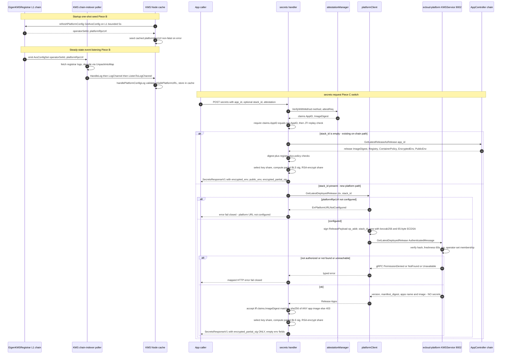

# KMS ↔ ecloud-platform Operator Integration — Design

**Date:** 2026-07-02
**Status:** Design — pending review
**Repos:** `eigenx-kms-go` (this repo, module `github.com/Layr-Labs/eigenx-kms-go`) + `ecloud-platform` (`/Users/seanmcgary/Code/ecloud-platform`, module `github.com/Layr-Labs/ecloud-platform`)

## 1. Overview & Scope

`ecloud-platform` PR #277 (merged) built the **platform server side**: a gRPC endpoint
`KMSService.GetLatestDeployedRelease(stackId)` on the platform's internal server that
returns a stack's active-release per-app container image digests, authenticated by an
operator signature. This design implements the **operator (client) side in this repo**,
plus the on-chain discovery mechanism operators use to find the platform endpoint.

Concretely, this delivers a **new attestation-authorization source**: for a `/secrets`
request that carries a `stack_id`, the KMS operator validates the attested container
image digest against the **ecloud-platform's** deployed release for that stack, rather
than against the on-chain `AppController`. Operators discover the platform's RPC URL by
reading it from the `EigenKMSRegistrar` contract on-chain.

On the platform path the operator returns **only the encrypted partial key share** —
not the application secrets. Unlike the on-chain `AppController` `Release`, which stores
`EncryptedEnv`/`PublicEnv` that the KMS relays back today, the platform owns secrets
itself and its release response carries none. Once the attested digest is verified, the
operator hands back the threshold key share (RSA-encrypted to the request's ephemeral
key); the caller uses it to decrypt secrets it fetches from the platform out of band.

### The three pieces

| # | Piece | Where | Purpose |
| --- | --- | --- | --- |
| A | `platformRpcUrl` in `AvsConfig` + change event | `contracts/` (Solidity) | On-chain publication of the platform endpoint for operator discovery |
| B | Event-driven config listening + startup seed | `pkg/contractCaller`, `pkg/node`, `pkg/registrarabi`, chain-indexer poller | Node listens for `AvsConfigSet` logs from the registrar and keeps the cached platform URL current; a one-shot startup read seeds it for offline changes |
| C | Signed platform gRPC client + `/secrets` switch | `pkg/clients/platformClient`, `pkg/node/handlers.go`, `gen/`, `protos/` | Call the platform, validate the attested digest against its release |

### Decisions locked during brainstorming

| Question | Decision |
| --- | --- |
| Role of the platform check vs. existing on-chain `AppController` digest check | A **new, additional means of attestation**. When a request carries a `stack_id`, validate against the **ecloud-platform API** instead of the on-chain `AppController`. Requests without a `stack_id` keep the existing on-chain path unchanged. |
| Where the platform RPC URL lives on-chain | **Added to `AvsConfig`** in `EigenKMSRegistrar.sol`. Emit an **event** when the config changes; the KMS operator server watches for config changes and pulls them in. |
| `stack_id` ↔ `app_id` relationship | Add an explicit **`stack_id`** field to the `/secrets` request. Its presence is the **switch**: `stack_id` set → validate via ecloud-platform; empty → validate via on-chain `AppController` by `app_id` (today's behavior). |
| Behavior when the platform URL is not configured on-chain, or the platform is unreachable | **Fail closed:** return an error to the caller that the platform URL was not configured (or that the platform is unreachable). No silent fallback to the on-chain path when a `stack_id` was supplied. |
| Proto acquisition (avoid the `eigenx-kms-go` ⇄ `ecloud-platform` module cycle) | **Git submodule** of `ecloud-platform` for proto provenance + **copy** the two `.proto` files into this repo's `protos/` tree + **generate the gRPC client locally** into this module's own path + **commit** the generated code. No `go.mod` dependency edge to `ecloud-platform` — the module cycle is fully avoided. |
| Generated client import path | `github.com/Layr-Labs/eigenx-kms-go/gen/protos/...` (self-contained; the only coherent choice for local compilation). Revisitable during planning. |
| Config-refresh mechanism | **Event-driven listening for the `AvsConfigSet` log** (the original brainstorming intent). The KMS node registers the registrar contract with its existing L1 chain-indexer poller: the registrar address is resolved at startup via `l1ContractCaller.GetAvsRegistrar(avsAddr)`, added to `EVMChainPollerConfig.InterestingContracts`, and registered in the `InMemoryContractStore` with the registrar ABI (embedded as JSON in `pkg/registrarabi` via `go:embed` from the concrete `EigenKMSRegistrar.sol`). The poller fetches the registrar's logs (address filter), decodes them (`abi.UnpackIntoMap`), and delivers them via `blockHandler.HandleLog` → a buffered `LogChannel` → `blockHandler.ListenToLogChannel`. The node consumes them in `startScheduler` via `go n.blockHandler.ListenToLogChannel(ctx, n.handlePlatformConfigLog)`; `handlePlatformConfigLog` ignores non-`AvsConfigSet` logs, reads `OutputData["platformRpcUrl"]`, validates via `isSafePlatformURL`, and stores into the `platformURL atomic.Value` cache (an empty URL clears it → "unconfigured"). A **one-shot startup seed** (`refreshPlatformConfig`, bounded 5s ctx, non-fatal, reading `GetAvsConfig` via the L1 contract caller) covers config changes made while the node was offline; steady-state updates come purely from events with no contract read. The poller's block cursor is persisted durably (`pkg/persistence/chainpolleradapter` over `INodePersistence`) so the cursor resumes across restarts and the startup seed bounds any missed-event gap. **Reversal note:** an earlier draft chose poll-refresh (per-block `GetAvsConfig` on the `checkScheduledOperations` modulus boundary) to avoid building the log-subscription pipeline; the shipped design reverts to event-listening per the original brainstorming intent, and the modulus-refresh block was removed. |
| Digest match rule | The attested `claims.ImageDigest` must match the `@sha256:<digest>` of **any** app in the platform's returned release (`Apps[].Image`). |
| Response on the platform path | Return **only** the encrypted partial key share (`EncryptedPartialSig` + echoed `ExtraData`); leave `EncryptedEnv`/`PublicEnv` **empty**. The platform owns secrets and its release response carries none. The on-chain path is unchanged (still returns on-chain `EncryptedEnv`/`PublicEnv`). |

### Out of scope

- Changing how the CoCo VM / app **decrypts** injected secrets (unchanged).
- The `/app/sign` handler (`pkg/node/handlers.go`), which is intentionally
  **not attestation-gated** today — it stays outside platform authorization.
- BN254 operator sets — the platform's operator auth is **ECDSA address-based**;
  this integration targets the ECDSA operator identity the node already uses for
  its transport signer.
- Migrating the `app_id → stack_id` relationship into any on-chain mapping. The
  `stack_id` is caller-supplied on the `/secrets` request.
- Extracting the platform client + protos into a standalone Go module. This is the
  **eventual** clean fix for the module-cycle concern; this design uses the
  submodule-and-local-codegen approach as the near-term step and documents the
  migration path (§8).

### Request/response flow

The node seeds the platform URL once at startup, then keeps it current by listening
for `AvsConfigSet` events emitted by the registrar, and uses it to authorize `/secrets`
requests that carry a `stack_id`. Requests without a `stack_id` never touch the platform.



## 2. Grounding: verified facts

### Platform server side (from `ecloud-platform`, PR #277)
- **Service:** `eigenlayer.platform.v1.kms.KMSService`, method
  `/eigenlayer.platform.v1.kms.KMSService/GetLatestDeployedRelease`. Client
  constructor `NewKMSServiceClient(cc grpc.ClientConnInterface) KMSServiceClient`.
  Generated package `github.com/Layr-Labs/ecloud-platform/gen/protos/eigenlayer/platform/v1/kms`.
- **Proto files** (`protos/eigenlayer/platform/v1/kms/kms.proto`, `rpc.proto`) are
  **self-contained**: `rpc.proto` imports only `kms.proto`; no `google.api`/annotations
  or other external proto deps. `go_package` is the platform path (overridden at
  codegen time on our side).
- **Messages** (verbatim field sets):
  - `AuthenticatedMessage{ Payload []byte (1); Hash []byte (2); Signature []byte (3) }`
  - `GetLatestDeployedReleaseRequest{ Auth *AuthenticatedMessage (1) }`
  - `DeployedApp{ Name string (1); Image string (2) }` — `Image` is the full ref incl. `@sha256:<digest>`.
  - `GetLatestDeployedReleaseResponse{ StackId string (1); Version int32 (2); ManifestDigest string (3); Apps []*DeployedApp (4) }`
- **Inner signed payload** (platform-side Go type `kms.ReleasePayload`, defined in
  `ecloud-platform/pkg/kms/authmsg.go`; the KMS side **redefines** it by the wire
  contract, not by import):
  ```go
  type ReleasePayload struct {
      FromOperatorAddress common.Address `json:"fromOperatorAddress"`
      StackID             string         `json:"stackId"`
      Timestamp           int64          `json:"timestamp"` // unix SECONDS
  }
  ```
  `common.Address` JSON-marshals as a `0x`-prefixed (EIP-55 checksummed) hex string.
- **Handler verification order** (`ecloud-platform/pkg/rpcServer/kmsHandler.go`,
  `pkg/kms/authmsg.go`):
  1. `operators == nil` → `Unavailable`; `Auth == nil` → `Unauthenticated`.
  2. `actual := gethcrypto.Keccak256(payload)`; require `bytes.Equal(actual, hash)` else `Unauthenticated("payload digest mismatch")`. **The wire `hash` is not trusted** — the server recomputes and verifies the signature against `actual`.
  3. JSON-unmarshal payload → `ReleasePayload`.
  4. Freshness: `|now.Unix() - Timestamp|` seconds; `> KMSAuthFreshnessWindow` → `Unauthenticated("stale request")`. `KMSAuthFreshnessWindow = 60 * time.Second`.
  5. `sig, _ := libecdsa.NewSignatureFromBytes(signature)` (requires exactly 65 bytes); `ok, _ := sig.VerifyWithAddress(actual, payload.FromOperatorAddress)`; not ok → `Unauthenticated`. `libecdsa` = `github.com/Layr-Labs/crypto-libs/pkg/ecdsa`.
  6. Membership: `operators.IsOperator(ctx, payload.FromOperatorAddress)` — matches the address against each peer's `WrappedPublicKey.ECDSAAddress` from the chain. Error → `Unavailable`; not a member → `PermissionDenied`.
  7. `GetActiveReleaseByStackId(StackID)`; nil release/manifest → `NotFound`; DB error → `Internal`. Success maps `Version`, stored `ManifestDigest`, and `Manifest.Spec.Apps[i]` → `DeployedApp{Name, Image}`.
- **Transport:** `KMSService` is registered **only on the internal gRPC server**
  (default port **9002**; HTTP gateway 9003 is NOT bound for this gRPC-only method).
  **No TLS** — dial with `grpc.WithTransportCredentials(insecure.NewCredentials())`.
  Auth is entirely the in-handler operator signature.

### KMS operator (client) side (this repo)
- **The node already has an ECDSA signer** wired in. `ITransportSigner`
  (`pkg/transportSigner/transportSigner.go:9`) —
  `SignMessage(data []byte) ([]byte, error)` keccak256's `data` and returns a
  65-byte `[R‖S‖V]` ECDSA signature; `CreateAuthenticatedMessage(data []byte)
  (*SignedMessage, error)` returns `{Payload, Hash=keccak256(payload), Signature}`.
  Both `InMemoryTransportSigner` (via `NewECDSAInMemoryTransportSigner`) and
  `Web3Signer` produce ECDSA signatures. The instance is on the node
  (`n.transportSigner`), constructed in `cmd/kmsServer/main.go` (~lines 332–386) and
  passed to `node.NewNode(...)`.
- **The signing counterpart of the platform's verify** is exactly what the node's
  signer already does: `crypto-libs/pkg/ecdsa.PrivateKey.Sign(hash)` /
  `.SignAndPack(hash [32]byte) ([]byte, error)` → 65-byte `[R‖S‖V]`; verified by
  `NewSignatureFromBytes` + `VerifyWithAddress`. crypto-libs is already a direct dep.
- **The node knows its own operator address:** `node.Config.OperatorAddress` /
  `n.OperatorAddress common.Address` (`pkg/node/node.go:48`), from
  `KMS_OPERATOR_ADDRESS` / `--operator-address`. This is `FromOperatorAddress`.
  The configured ECDSA key must recover to the on-chain registered `ECDSAAddress`
  (operators already ensure this at registration; no new runtime assertion added).
- **Existing digest validation** in `handleSecretsRequest`
  (`pkg/node/handlers.go:192-205`): fetches `release, _ :=
  s.node.baseContractCaller.GetLatestReleaseAsRelease(r.Context(), req.AppID)`, then
  `if claims.ImageDigest != release.ImageDigest { → 403 }`. Also checks registry
  (`:219`, when `claims.Registry != ""`) and container policy (`:242-255`).
  `claims.ImageDigest` is `sha256:<hex>` (e.g. `attestation.go:213`,
  `eigenx_snp_method.go:481`; ECDSA yields the placeholder `"ecdsa:unverified"`).
- **`SecretsRequestV1`** (`pkg/types/types.go:132`) has `AppID`, `AttestationMethod`,
  `Attestation`, `RSAPubKeyTmp`, `AttestationTime`, `Challenge`, `PublicKey`,
  `ExtraData`, `CCInitData`. **No `stack_id` today** — this design adds it.
- **On-chain reads:** the node resolves the registrar from the AVS address via
  `cc.allocationManager.GetAVSRegistrar(&bind.CallOpts{}, avsAddr)` then
  `IEigenKMSRegistrar.NewIEigenKMSRegistrarCaller(addr, cc.ethclient)`
  (`pkg/contractCaller/caller/caller.go:144-170`, the socket-read path). The binding
  exposes `GetAvsConfig(opts) (IEigenKMSRegistrarTypesAvsConfig, error)` returning
  `{ OperatorSetId uint32 }` today. There is **no** `AvsConfig` event yet and **no**
  `ContractCaller.GetAvsConfig` wrapper — both are added here.
- **Block reactions:** the node polls blocks (chain-indexer) and runs
  `checkScheduledOperations` per block (`pkg/node/node.go:400`). The reshare scheduler is
  block-number-modulo driven. As shipped, the registrar contract **is** registered with
  the chain-indexer poller (its `InterestingContracts` + `InMemoryContractStore` with the
  registrar ABI), and `HandleLog` is **no longer a no-op** — it decodes and delivers
  matched logs onto a buffered `LogChannel`, drained by `ListenToLogChannel`. This is the
  log-subscription pipeline the node uses to react to `AvsConfigSet`.
- **Bindings regeneration:** `./scripts/compileMiddlewareBindings.sh` runs
  `forge build` + `abigen` + `jq`, regenerating
  `pkg/middleware-bindings/IEigenKMSRegistrar/binding.go` (and others). Contracts use
  Foundry (`foundry.toml`, `solc 0.8.27`); `make build/contracts` / `make forge-test`.
- **Proto tooling:** this repo has **no** `.proto`/`buf`/`gen` today, but `buf`,
  `protoc`, `protoc-gen-go`, and `protoc-gen-go-grpc` are all installed, and
  `google.golang.org/grpc` / `google.golang.org/protobuf` are already transitive deps.

### AvsConfig construction sites (must be updated for the new field)
- `contracts/src/interfaces/IEigenKMSRegistrar.sol` — struct definition + new event.
- `contracts/src/EigenKMSRegistrar.sol` — `_setAvsConfig` emits the event.
- `contracts/script/preprod/DeployEigenKMSRegistrar.s.sol:40` — `initialConfig` literal.
- `contracts/script/local/DeployEigenKMSRegistrar.s.sol` — `initialConfig` literal.
- `contracts/test/EigenKMSRegistrar.t.sol:45,72` — `AvsConfig{...}` literals + new event/round-trip test.

## 3. Piece A — Contract: `platformRpcUrl` in `AvsConfig` + change event

### Solidity changes
`contracts/src/interfaces/IEigenKMSRegistrar.sol`:
```solidity
interface IEigenKMSRegistrarTypes {
    struct AvsConfig {
        uint32 operatorSetId;
        string platformRpcUrl; // ecloud-platform internal gRPC endpoint, e.g. host:9002
    }

    /// @notice Emitted whenever the AVS config is set/changed.
    event AvsConfigSet(uint32 operatorSetId, string platformRpcUrl);
}
```
`contracts/src/EigenKMSRegistrar.sol` — `_setAvsConfig`:
```solidity
function _setAvsConfig(IEigenKMSRegistrarTypes.AvsConfig memory config) internal {
    avsConfig = config;
    emit IEigenKMSRegistrarTypes.AvsConfigSet(config.operatorSetId, config.platformRpcUrl);
}
```
(The event is declared on the types interface so it is available on the generated
binding's `Filter*/Watch*/Parse*` methods for external tooling.)

### Downstream updates
- Both deploy scripts: add `platformRpcUrl: ""` (or an env-driven value) to the
  `initialConfig` literal.
- `EigenKMSRegistrar.t.sol`: update the `AvsConfig{...}` literals; add
  `test_SetAvsConfig_EmitsEvent` (expect `AvsConfigSet`) and a round-trip asserting
  `getAvsConfig().platformRpcUrl` persists the set value.
- Regenerate bindings: `forge build` then `./scripts/compileMiddlewareBindings.sh`.
  The regenerated `IEigenKMSRegistrarTypesAvsConfig` gains `PlatformRpcUrl string`,
  and `Filter/Watch/ParseAvsConfigSet` appear on the binding.

**Verified external API (do not re-derive)** — post-regeneration binding shape:
```go
// pkg/middleware-bindings/IEigenKMSRegistrar/binding.go (after regen)
type IEigenKMSRegistrarTypesAvsConfig struct {
    OperatorSetId  uint32
    PlatformRpcUrl string
}
func (_IEigenKMSRegistrar *IEigenKMSRegistrarCaller) GetAvsConfig(opts *bind.CallOpts) (IEigenKMSRegistrarTypesAvsConfig, error)
```

## 4. Piece B — Event-driven config listening + startup seed

### ContractCaller: read `AvsConfig`
`GetAvsConfig` is still added (it backs the one-shot startup seed below). Add to
`pkg/contractCaller` (interface `contractCaller.go`) and its `caller`
implementation, mirroring the socket-read block (`caller.go:144-170`):
```go
// AvsConfig is the platform-relevant slice of the on-chain registrar config.
type AvsConfig struct {
    OperatorSetId  uint32
    PlatformRpcUrl string
}

// GetAvsConfig resolves the registrar from the AVS address and reads its config.
GetAvsConfig(ctx context.Context, avsAddress string) (*AvsConfig, error)
```
Implementation: `GetAVSRegistrar(avsAddr)` → `NewIEigenKMSRegistrarCaller(addr,
ethclient)` → `caller.GetAvsConfig(&bind.CallOpts{Context: ctx})`; map to
`*AvsConfig`.

### Node: event-driven cache + startup seed
The URL cache (`platformURL atomic.Value`, exposed via `PlatformRpcURL()`) stays; the
`platformClient` reads it live at call time. What changed is how it is populated: the
node **listens** for `AvsConfigSet` events rather than polling per block. The old
`blockNumber%blockInterval == 0` modulus-refresh block in `checkScheduledOperations`
was **removed**.

**Registering the registrar with the chain-indexer poller (on L1):** the registrar
lives on the L1 (`--rpc-url`) chain, the same chain the node's existing chain-indexer
poller (built on the L1 `ethClient`) polls. At startup the node:
- resolves the registrar address via `l1ContractCaller.GetAvsRegistrar(avsAddr)`;
- adds that address to `EVMChainPollerConfig.InterestingContracts`;
- registers it in the `InMemoryContractStore` with the registrar's ABI, embedded as
  JSON in a new `pkg/registrarabi` package via `go:embed` (the ABI comes from the
  concrete `EigenKMSRegistrar.sol`, which declares the `AvsConfigSet` event).

**Log path:** the poller fetches logs for the registrar (address filter), decodes them
with go-ethereum `abi.UnpackIntoMap`, and delivers each decoded log via
`blockHandler.HandleLog` → a new buffered `LogChannel` → `blockHandler.ListenToLogChannel`.
The node subscribes in `startScheduler`:
```go
go n.blockHandler.ListenToLogChannel(ctx, n.handlePlatformConfigLog)
```
`handlePlatformConfigLog` ignores non-`AvsConfigSet` logs, reads
`OutputData["platformRpcUrl"]` (a Go `string`; both event args are non-indexed so they
land in `OutputData`), validates it via `isSafePlatformURL` (rejects `file://`,
`unix:`, `unix-abstract://`, and `http(s)://`), and stores the result into the
`platformURL atomic.Value`. An **empty** URL is stored, clearing the cache back to
"unconfigured".

**Startup seed:** `Start()` performs ONE `refreshPlatformConfig` call (bounded 5s ctx,
non-fatal) so the URL is populated before the first request AND to cover any config
change made while the node was offline. `refreshPlatformConfig` reads via a new
`platformConfigCaller` node field bound to the **L1** contract caller — so the seed
reads the same chain the events come from — falling back to `baseContractCaller` when
nil (tests). Steady-state updates thereafter come from `AvsConfigSet` events with no
contract read.

**Durable persistence:** the chain-indexer poller's block cursor is persisted via a new
`pkg/persistence/chainpolleradapter` over the node's `INodePersistence` (block-record
CRUD added to the memory/badger/redis backends), so the cursor survives restarts. This
closes the old `TODO(seanmcgary)` and is what bounds "missed events across restarts":
the cursor resumes where it left off, and the startup seed covers any residual gap.

**Rationale for subscribe-not-poll:** this is the original brainstorming intent —
react to the emitted event rather than re-reading config on a timer. Registering the
contract with the chain-indexer store and implementing the (previously no-op)
`HandleLog` is the pipeline that makes it work; the durable cursor + startup seed
handle reorg/missed-log/offline concerns that the poll approach was chosen to sidestep.

## 5. Piece C — Platform gRPC client + `/secrets` switch

### Proto vendoring & codegen (module-cycle-safe)
- Add `ecloud-platform` as a **git submodule** for proto provenance
  (e.g. `third_party/ecloud-platform`, pinned to the PR #277 commit). `.gitmodules`
  records the pin.
- **Copy** `kms.proto` and `rpc.proto` into this repo under
  `protos/eigenlayer/platform/v1/kms/`. A short header comment records their origin
  (submodule path + commit) so drift is auditable. A `make protos-sync` helper may
  copy from the submodule, but the committed source of truth is the copy under
  `protos/`.
- Add `buf.gen.yaml` (managed mode) that **overrides `go_package`** to
  `github.com/Layr-Labs/eigenx-kms-go/gen/protos/eigenlayer/platform/v1/kms` and
  generates with `protoc-gen-go` + `protoc-gen-go-grpc`
  (`require_unimplemented_servers=false`; no gateway — gRPC only).
- Add a `make protos` target running `buf generate` (or a `protoc` invocation). Commit
  the generated `gen/protos/.../kms/*.pb.go` + `*_grpc.pb.go`.
- Promote `google.golang.org/grpc` to a **direct** dependency; `go mod tidy`.
- **No `go.mod` require on `github.com/Layr-Labs/ecloud-platform`** — the cycle is
  avoided entirely.

### platformClient package (`pkg/clients/platformClient`)
```go
// ReleasePayload is the inner signed message. It is redefined here to match the
// ecloud-platform WIRE contract (JSON tags), NOT imported, to avoid the module cycle.
type ReleasePayload struct {
    FromOperatorAddress common.Address `json:"fromOperatorAddress"`
    StackID             string         `json:"stackId"`
    Timestamp           int64          `json:"timestamp"` // unix seconds
}

type Client interface {
    // GetLatestDeployedRelease signs {operatorAddr, stackID, now} with the node's
    // ECDSA transport signer and calls the platform. Returns the release apps.
    GetLatestDeployedRelease(ctx context.Context, stackID string) (*Release, error)
}

type Release struct {
    StackID        string
    Version        int32
    ManifestDigest string
    Apps           []App // {Name, Image}
}
```
Construction/behavior:
- Built with `{ url string, operatorAddress common.Address, signer transportSigner.ITransportSigner, logger }`. Dials `grpc.NewClient(url,
  grpc.WithTransportCredentials(insecure.NewCredentials()))` (lazy or per-call; a
  cached conn keyed by URL, rebuilt when the URL changes).
- Request build: `payload := ReleasePayload{operatorAddress, stackID, now.Unix()}`;
  `data := json.Marshal(payload)`; obtain `{Hash, Signature}` from the node signer
  (`CreateAuthenticatedMessage(data)`), which computes `keccak256(data)` and the
  65-byte ECDSA sig. Populate `kmsv1.AuthenticatedMessage{Payload: data, Hash:
  hash[:], Signature: sig}` and call `NewKMSServiceClient(conn).GetLatestDeployedRelease`.
- gRPC status codes are surfaced as typed errors (Unauthenticated/PermissionDenied/
  NotFound/Unavailable) so the handler maps them to appropriate HTTP responses.
- **URL source:** the client reads the current URL from the node's cached holder
  (Piece B). Empty URL → return a sentinel `ErrPlatformURLNotConfigured` (fail-closed).

The client depends on `transportSigner.ITransportSigner` (already on the node) and the
generated `kmsv1` package — nothing that imports back into it.

### `/secrets` handler switch
- Add `StackID string \`json:"stack_id,omitempty"\`` to `SecretsRequestV1`.
- In `handleSecretsRequest`, after attestation verification and the
  `claims.AppID == req.AppID` bind, branch on `req.StackID`:
  - **`req.StackID == ""`** → existing on-chain `AppController` path, unchanged
    (`GetLatestReleaseAsRelease(req.AppID)` + digest/registry/policy checks).
  - **`req.StackID != ""`** → platform path:
    1. `rel, err := platformClient.GetLatestDeployedRelease(ctx, req.StackID)`.
    2. `ErrPlatformURLNotConfigured` → HTTP error to caller stating the platform URL
       is not configured (fail-closed). Other client errors → map platform gRPC codes
       (Unavailable → 503, PermissionDenied → 403, NotFound → 404, Unauthenticated →
       500 (operator misconfig, not caller's fault) — exact mapping a plan detail).
    3. **Digest match:** accept iff `claims.ImageDigest` equals the `@sha256:<digest>`
       portion of **any** `rel.Apps[].Image`. Extract the digest after `@sha256:` and
       compare to `claims.ImageDigest` (which is `sha256:<hex>`). No match → 403
       `"image digest not authorized by platform release"`.
    4. Registry/policy checks: the platform response carries only `{Name, Image}` — it
       does **not** carry registry allowlist or container policy. For the platform
       path, digest match is the authorization gate; registry/policy enforcement that
       depends on on-chain `Release` fields is **not applied** (documented limitation).
       The ECDSA attestation method yields `"ecdsa:unverified"` and therefore **cannot
       satisfy** the platform digest match — platform validation requires a
       digest-bearing attestation (GCP/Intel/eigenx-snp). This is called out explicitly.
- **Response differs on the platform path — return only the key share, not secrets.**
  The on-chain path today returns `EncryptedEnv`/`PublicEnv` sourced from the on-chain
  `Release` (secrets are stored on-chain). The **platform** `GetLatestDeployedRelease`
  response carries **no env/secrets** — the platform manages secrets itself. So once
  the digest is verified, the platform path returns **only** the encrypted partial key
  share (`EncryptedPartialSig`, plus the echoed `ExtraData`); `EncryptedEnv` and
  `PublicEnv` are left **empty**. The caller uses the recovered threshold key share to
  decrypt secrets it fetches from the platform out of band. Key-share selection
  (`AttestationTime`/active version), partial-sig computation (`signAppIDWithVersion`),
  and RSA-encryption of the share are **identical** to the on-chain path; only the
  release-authorization source and the env fields of the response differ.

### Wiring
- `cmd/kmsServer/main.go`: after the transport signer and contract caller are built,
  construct the platformClient (with the signer + operator address + a URL accessor
  bound to the node's cached holder) and pass it into `node.NewNode(...)` as a new
  dependency. In fake/local dev with no platform, the client is still constructed;
  it fails closed per request.
- `node.NewNode(...)` gains a `platformClient platformClient.Client` param + field,
  consumed by `handleSecretsRequest` via `s.node.platformClient`.

## 6. Interfaces & testability

- **`platformClient.Client`** is an interface → handler tests inject a fake
  (member/non-member, digest match/mismatch, `ErrPlatformURLNotConfigured`,
  Unavailable) with no gRPC/chain.
- **`ContractCaller.GetAvsConfig`** is on the existing `IContractCaller` interface →
  node tests inject a fake caller returning a fixed/mutating URL.
- **Signing round-trip** is pure: sign a `ReleasePayload` with a throwaway ECDSA key
  via the in-memory transport signer, then verify with
  `crypto-libs/pkg/ecdsa.NewSignatureFromBytes` + `VerifyWithAddress` against the
  derived address — proving the bytes the platform will accept.
- The **live gRPC path** (real dial to a platform server) is integration-only, not in
  `make test`.

## 7. Testing

- **Contract (forge):** `AvsConfigSet` emitted on `setAvsConfig`; `getAvsConfig()`
  round-trips `platformRpcUrl`; existing access-control tests still pass.
- **`GetAvsConfig` (Go):** binding maps to `{OperatorSetId, PlatformRpcUrl}` (covered
  via the caller wrapper; live chain path is integration-only).
- **platformClient signing round-trip:** JSON payload → keccak256 → 65-byte sig →
  `VerifyWithAddress` succeeds for the operator address; tamper a payload byte / use a
  wrong key → verification fails. Timestamp is unix seconds.
- **`handleSecretsRequest` switch (fake platformClient):**
  - `stack_id` empty → on-chain path exercised (existing tests unchanged).
  - `stack_id` set, digest matches an app → 200; response has `EncryptedPartialSig`
    populated and `EncryptedEnv`/`PublicEnv` **empty** (secrets not returned).
  - `stack_id` set, digest matches no app → 403.
  - `stack_id` set, URL not configured → fail-closed error to caller.
  - `stack_id` set, platform Unavailable/PermissionDenied/NotFound → mapped codes.
  - ECDSA attestation + `stack_id` → rejected (no real digest).
- **Config refresh (fake caller):** URL change on chain is reflected in the cached
  holder after the refresh tick; empty URL leaves the handler fail-closed.
- Full gates: `go build ./...`, `make lint`, `make fmtcheck`, `make test`
  (includes `forge-test`), and `./scripts/compileMiddlewareBindings.sh` produces no
  unexpected drift.

## 8. Module-cycle note & migration path

`ecloud-platform` imports `eigenx-kms-go` (`pkg/clients/kmsClient`,
`pkg/contractCaller/caller`, `pkg/crypto`, `pkg/peering`, `pkg/types`). To keep
`eigenx-kms-go` from importing `ecloud-platform` (which would create a mutual module
dependency that complicates `go mod tidy`, MVS, and coordinated release tagging), this
design **vendors the proto source via submodule and generates the client locally into
this module's own path** — there is no `go.mod` edge to `ecloud-platform`.

**Eventual clean fix (out of scope here):** extract the KMS-facing protos + generated
client (and possibly the thin platform client) into a **standalone Go module/repo**
that both `eigenx-kms-go` and `ecloud-platform` import. At that point the submodule +
local codegen in this repo is replaced by a normal `require` on the standalone module,
and the vendored `protos/` copy is removed.

## 9. File Inventory

New:
- `protos/eigenlayer/platform/v1/kms/kms.proto`, `rpc.proto` (copied; origin-commented)
- `buf.gen.yaml` (+ `make protos`, `make protos-sync` targets in `Makefile`)
- `gen/protos/eigenlayer/platform/v1/kms/*.pb.go`, `*_grpc.pb.go` (generated, committed)
- `pkg/clients/platformClient/` — `Client` interface + impl + `ReleasePayload` + tests
- `.gitmodules` entry + `third_party/ecloud-platform` submodule

Modified:
- `contracts/src/interfaces/IEigenKMSRegistrar.sol` — `AvsConfig.platformRpcUrl` + `AvsConfigSet` event
- `contracts/src/EigenKMSRegistrar.sol` — emit `AvsConfigSet` in `_setAvsConfig`
- `contracts/script/preprod/DeployEigenKMSRegistrar.s.sol`, `contracts/script/local/DeployEigenKMSRegistrar.s.sol` — `initialConfig` literal
- `contracts/test/EigenKMSRegistrar.t.sol` — literals + event/round-trip tests
- `pkg/middleware-bindings/IEigenKMSRegistrar/binding.go` — regenerated
- `pkg/contractCaller/contractCaller.go` + `pkg/contractCaller/caller/caller.go` — `GetAvsConfig` + `AvsConfig` type
- `pkg/node/node.go` — cached platform-URL holder, per-block refresh, `platformClient` field/param, startup read
- `pkg/node/handlers.go` — `/secrets` `stack_id` switch + platform digest match
- `pkg/types/types.go` — `SecretsRequestV1.StackID`
- `cmd/kmsServer/main.go` — construct & inject `platformClient`
- `go.mod` / `go.sum` — `google.golang.org/grpc` promoted to direct
- `Makefile` — `protos` / `protos-sync` targets

## 10. Open items (resolve during planning/impl)

1. ~~**Config-refresh interval.** Exact block modulus (or every-block) for the
   `GetAvsConfig` poll — bound RPC load vs. freshness. Plan-time constant.~~ **Resolved
   by the event-driven rework:** there is no poll interval; updates arrive via
   `AvsConfigSet` events (§4) and a one-shot startup seed. `GetAvsConfig` is read only
   once at startup.
2. **gRPC error → HTTP code mapping** for the platform path (esp. Unauthenticated,
   which indicates operator misconfig rather than caller fault).
3. **buf vs protoc invocation** for `make protos` (buf is installed; either works).
   Confirm managed-mode `go_package` override syntax that pins our module path.
4. **Registry/policy on the platform path.** The platform response lacks registry and
   container-policy fields; confirm digest-only authorization is acceptable for the
   platform path (documented limitation) or whether a later platform response
   extension is needed.
5. **`stack_id` provenance/trust.** `stack_id` is caller-supplied; the platform
   authorizes by returning that stack's release and the digest must match the
   attestation. Confirm no additional binding between `app_id` and `stack_id` is
   required for the threat model.
