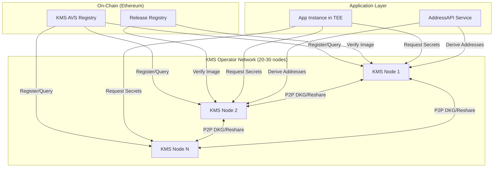
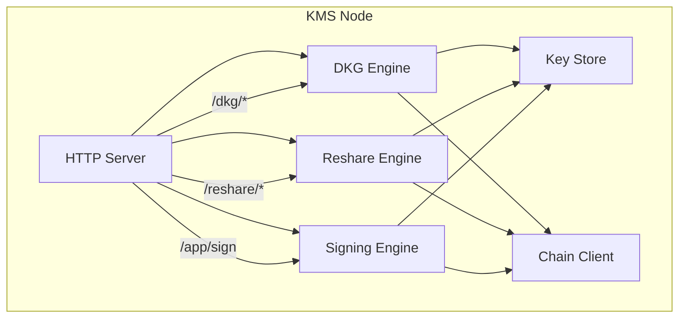
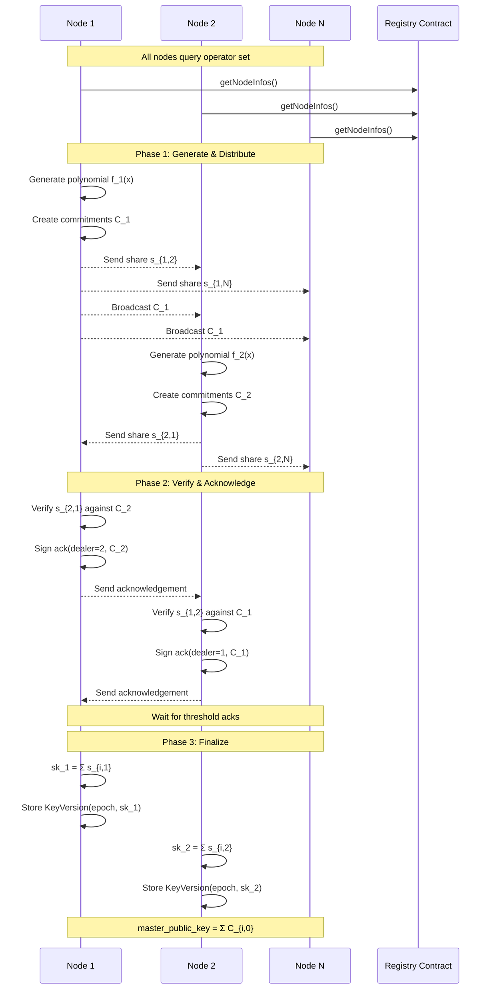
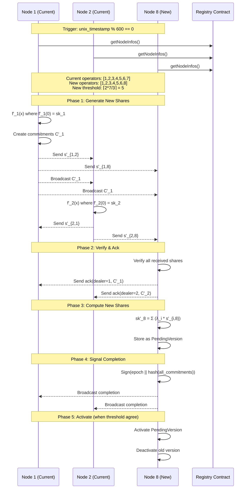
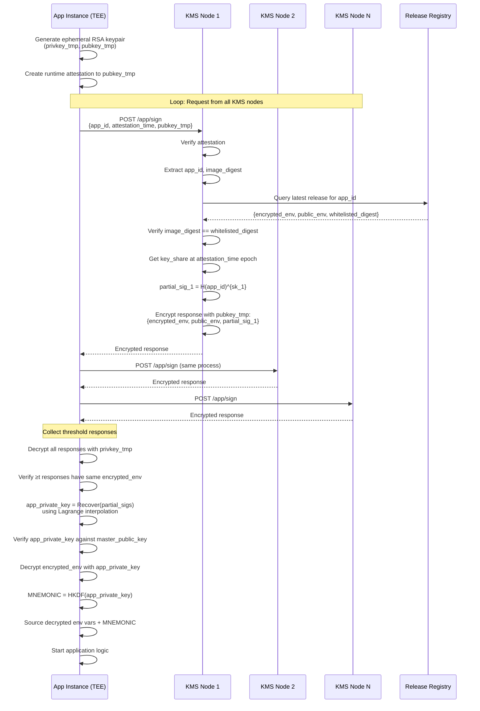
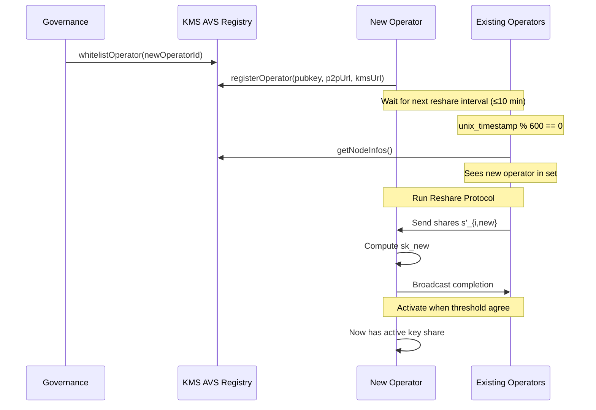
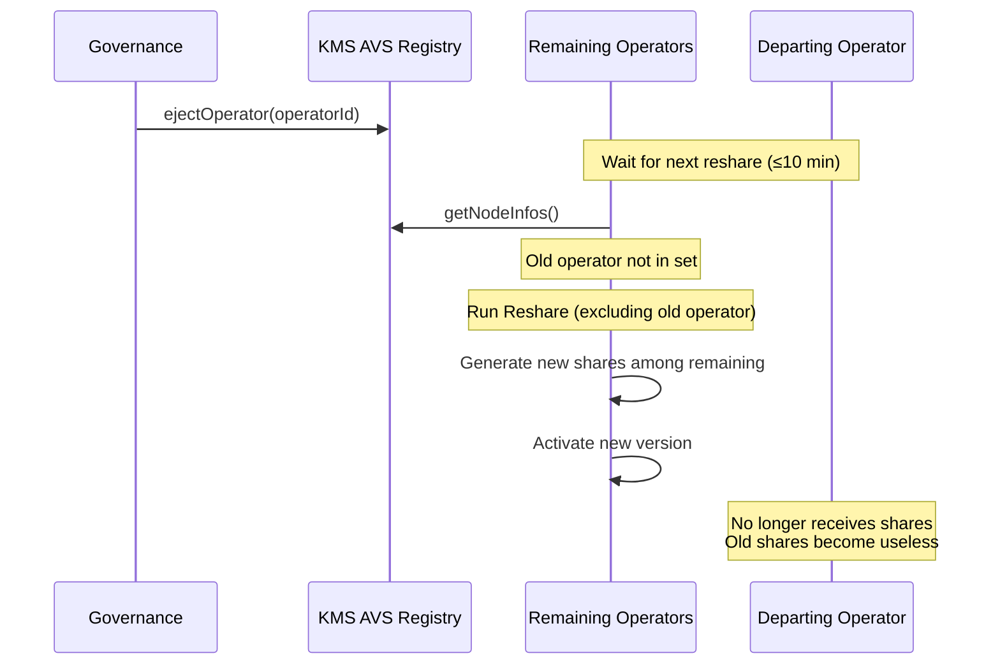

# EigenX KMS AVS - Technical Design Document

## Executive Summary

The EigenX KMS AVS is a distributed key management system running as an EigenLayer AVS that provides threshold cryptography-based secret management for EigenCompute applications. The system uses BLS12-381 threshold signatures combined with Identity-Based Encryption (IBE) to ensure that only attested application code running the latest on-chain whitelisted version can access secrets.

**Key Properties:**
- **Threshold Security**: Requires ⌈2n/3⌉ operators to collude for any security breach
- **Decentralized Trust**: No single point of failure, no trusted dealer
- **Automatic Key Rotation**: Reshares every 10 minutes to support operator set changes
- **TEE-Based Application Security**: Applications run in Google Confidential Space with runtime attestation
- **Operator Accountability**: Signed acknowledgements prevent equivocation, tied to EigenLayer stake

---

## System Architecture

### High-Level Components



### KMS Node Architecture



---

## Cryptographic Foundations

### BLS12-381 Curve Groups

- **G1**: Used for signature shares (app private keys)
- **G2**: Used for commitments and master public key
- **Pairing**: e: G1 × G2 → GT for verification

### Threshold Scheme

- **Threshold**: t = ⌈2n/3⌉
- **Polynomial Degree**: t - 1
- **Share Recovery**: Lagrange interpolation over any t shares

### Key Relationships

```
master_secret_key (x) = Σ s_i * λ_i           [Never exists in full]
master_public_key = x * G2                     [Public, in G2]

app_private_key = H(app_id)^x                  [In G1, threshold signature]
app_public_key = e(H(app_id), master_public_key)  [For verification]
```

---

## Protocol Flows

### 1. Initial DKG (Distributed Key Generation)



**Key Steps:**

1. **Phase 1 - Generate & Distribute** (Steps 1-2):
    - Each node i generates random polynomial f_i(x) of degree t-1
    - Compute shares: s_{i,j} = f_i(j) for each node j
    - Create commitments: C_{i,k} = a_{i,k} * G2
    - Broadcast commitments to all
    - Send shares privately to each node

2. **Phase 2 - Verify & Acknowledge** (Steps 3-4):
    - Each node j verifies received share from i: s_{i,j} * G2 = Σ(C_{i,k} * j^k)
    - If valid, create signed acknowledgement: Sign(p2p_privkey, dealer_id || hash(C_i))
    - Send acknowledgement back to dealer
    - Dealers wait for threshold acknowledgements

3. **Phase 3 - Finalize** (Steps 5-6):
    - Each node computes private key share: sk_j = Σ s_{i,j}
    - Store as active key version with epoch timestamp
    - Master public key computed as: mpk = Σ C_{i,0}

---

### 2. Reshare Protocol (Every 10 Minutes)



**Reshare Key Properties:**

1. **Constant Term Preservation**: Each dealer's new polynomial f'_i(0) = s_i (their current share)
2. **Lagrange Reconstruction**: New shares computed as x'_j = Σ_{i∈operators} λ_i * s'_{ij}
3. **Secret Preservation**: The aggregate secret remains: x = Σ_{i} λ_i * s_i
4. **Threshold Agreement**: Activate only when ≥t completion signatures received
5. **Timeout Safety**: If reshare fails (2 min timeout), abandon and retry at next interval

---

### 3. Application Secret Retrieval



**Security Properties:**

1. **Attestation Verification**: Each KMS node independently verifies the TEE attestation
2. **On-Chain Authorization**: Image digest must match on-chain whitelisted release
3. **Key Versioning**: Uses key share from attestation timestamp epoch
4. **Response Encryption**: Prevents workload operator from seeing secrets
5. **Threshold Agreement**: Application requires ≥t consistent responses
6. **Verification**: Application verifies recovered key against master public key

---

## Security Model

### Threat Model

**Trust Assumptions:**
- At least ⌈2n/3⌉ KMS operators are honest
- Operator p2p_pubkeys are correctly registered on-chain
- On-chain release registry is honest (governance-controlled)
- TEE attestations are unforgeable (relies on Google CS)

**Attack Scenarios:**

| Attack | Required Compromise | Outcome |
|--------|-------------------|---------|
| < t operators malicious | < ⌈2n/3⌉ operators | **SAFE**: Cannot recover master_secret_key or app keys |
| ≥ t operators malicious | ≥ ⌈2n/3⌉ operators | **BREACH**: Can recover secrets and sign for any app |
| < t operator key exfiltration | < ⌈2n/3⌉ key shares in same epoch | **SAFE**: Insufficient shares to reconstruct |
| Workload operator MITM | Cloud provider | **SAFE**: Responses encrypted with TEE ephemeral key |
| ≥ t RPC compromise | ≥ ⌈2n/3⌉ ETH RPCs | **BREACH**: Can serve wrong release data |

### Liveness vs Safety

**Liveness Failures** (app cannot start):
- < t KMS nodes responsive
- < t KMS nodes have consistent environment files
- Network partition during reshare
- Workload operator provides wrong KMS URLs

**Safety Failures** (unauthorized code gets secrets):
- ≥ t KMS operators collude
- ≥ t KMS node ETH RPCs compromised
- On-chain release registry compromised (governance attack)

---

## On-Chain Interface

### KMS AVS Registry

```solidity
interface IKmsAvsRegistry {
    struct OperatorInfo {
        bytes32 operatorId;
        bytes ed25519PubKey;  // For signing acknowledgements
        string p2pNodeUrl;    // For P2P communication
        string kmsServerUrl;  // For application requests
    }
    
    /// @notice Get all registered operators
    function getNodeInfos() external view returns (OperatorInfo[] memory);
    
    /// @notice Post completion signature for DKG
    function postDKGCompletion(
        bytes32 masterPublicKey,
        bytes signature  // Sign(p2p_privkey, masterPublicKey)
    ) external;
}
```

### Release Registry

```solidity
interface IReleaseRegistry {
    struct Release {
        string imageDigest;      // sha256:abc123...
        bytes encryptedEnv;      // Encrypted with IBE
        string publicEnv;        // Plain text env vars
        uint256 timestamp;
    }
    
    /// @notice Get latest release for application
    function getLatestRelease(string calldata appId) 
        external view returns (Release memory);
}
```

---

## Operational Flows

### Adding a New Operator



### Removing an Operator



---

## Implementation Details

### Key Versioning

Each node maintains multiple key versions:

```go
type KeyShareVersion struct {
    Version        int64       // Reshare epoch (unix_time / 600)
    PrivateShare   *fr.Element // This node's share of master_secret_key
    Commitments    []G2Point   // Public commitments from DKG/reshare
    IsActive       bool        // Whether this is the current version
    ParticipantIDs []int       // Operators in this version
}
```

**Version Lookup:**
- Application attestation includes issued-at-time (iat)
- KMS node computes: epoch = iat / 600
- Uses key share from that epoch (or active if not found)
- Handles transition periods where old and new coexist

### Acknowledgement Format

```go
type Acknowledgement struct {
    DealerID       int
    PlayerID       int
    CommitmentHash [32]byte     // SHA256(commitments)
    Signature      []byte        // ed25519.Sign(p2p_privkey, dealerID || commitmentHash)
}
```

**Purpose:**
- Prevents dealer equivocation (sending different commitments to different players)
- Proves player verified the commitment
- Cryptographically binds commitment to dealer
- Signature verifiable on-chain if dispute

### Timeout and Retry Logic

| Operation | Timeout | Retry Strategy |
|-----------|---------|----------------|
| Share send | 5s | Exponential backoff, max 5 attempts |
| Wait for shares | 60s | Poll every 200ms |
| Wait for acks | 30s | Poll every 200ms |
| Wait for completions | 30s | Poll every 200ms |
| Full reshare | 2 min | Abandon and retry at next interval |

---

## Performance Characteristics

### Network Communication

**DKG (one-time):**
- Shares: O(n²) point-to-point messages
- Commitments: O(n) broadcasts
- Acknowledgements: O(n²) messages
- **Total**: ~3n² messages for n operators

**Reshare (every 10 min):**
- Same as DKG: ~3n² messages
- **Example**: 30 operators = ~2,700 messages per reshare

**Application Secret Request:**
- Application sends n requests (one to each KMS node)
- Receives n responses
- **Total**: 2n messages per app startup

### Computation Complexity

**Per Node:**
- Polynomial evaluation: O(t) per share = O(nt) total
- Share verification: O(t) per share = O(nt) total
- Lagrange interpolation: O(t²) for recovery
- Commitment generation: O(t) scalar multiplications

**For 30 operators (t=20):**
- ~600 polynomial evaluations
- ~600 verifications
- ~400 scalar mults for Lagrange

### Storage Requirements

**Per Node:**
- Active key share: ~32 bytes
- Historical versions (keep ~100): ~3.2 KB
- Operator registry cache: ~10 KB
- **Total**: < 50 KB per node

---

## Failure Modes and Recovery

### Reshare Failure

**Causes:**
- Network partition
- < t nodes responsive
- Disagreement on operator set

**Recovery:**
- Abandon reshare after 2-minute timeout
- Keep active version unchanged
- Retry at next 10-minute interval
- Operators can manually sync if persistent issues

### Application Startup Failure

**Causes:**
- < t KMS nodes reachable
- Disagreement on environment files
- Attestation verification fails

**Recovery:**
- Application exits with error
- Workload operator retries app startup
- If persistent, investigate KMS node health
- Check on-chain release matches expected image

### Catastrophic Key Loss

**Prevention:**
- Require ≥ t+1 nodes always online
- Monitor operator health continuously
- Automate operator replacement

**Recovery (if < t nodes online):**
- System is bricked - secrets permanently lost
- Must re-deploy applications with new secrets
- **This is by design** - better than compromise

---

## Monitoring and Observability

### Key Metrics

**Per Node:**
- `kms_dkg_duration_seconds` - Time to complete DKG
- `kms_reshare_duration_seconds` - Time to complete reshare
- `kms_reshare_failures_total` - Count of failed reshares
- `kms_shares_verified_total` - Count of verified shares
- `kms_acks_received_total` - Count of acknowledgements received
- `kms_app_sign_requests_total` - Count of app signature requests
- `kms_app_sign_latency_seconds` - Latency to serve app requests

**System-Wide:**
- `kms_active_operators` - Current operator count
- `kms_threshold` - Current threshold
- `kms_reshare_epoch` - Current key version epoch
- `kms_consensus_health` - Fraction of nodes that completed last reshare

### Alerting

**Critical:**
- Reshare fails 3 times consecutively
- < t+1 operators healthy
- Operator can't reach quorum for > 1 hour

**Warning:**
- Single reshare failure
- Operator missed last reshare
- App request latency > 5s p99

---

## Future Enhancements

### Short Term
1. **Reveal mechanism** - Allow dealers to reveal shares of non-responding nodes
2. **Complaint tracking** - Integrate with AVS slashing
3. **Better RPC diversity** - Each node uses multiple RPCs with majority voting
4. **Metrics dashboard** - Real-time operator health visualization

### Medium Term
1. **Encrypted P2P channels** - Add TLS mutual auth between operators
2. **Rate limiting** - Prevent DoS on app signing endpoints
3. **Geographic distribution** - Ensure operators spread across regions
4. **Automated operator rotation** - Replace unhealthy operators

### Long Term
1. **Multi-curve support** - Support other pairing-friendly curves
2. **Threshold optimization** - Explore t < 2n/3 with stronger assumptions
3. **ZKP-based DKG** - Drop synchrony assumptions using Groth21/Kate23
4. **Hardware security modules** - Protect key shares in HSMs

---

## Conclusion

The EigenX KMS AVS provides a robust, decentralized key management system that eliminates single points of trust while maintaining strong security guarantees. By combining threshold cryptography, TEE-based attestation, and EigenLayer's economic security, the system ensures that only authorized application code can access secrets, while requiring a supermajority of operators to collude for any security breach.

The automatic reshare mechanism provides operational flexibility for operator set changes, while the 2-minute timeout ensures the system fails safe rather than allowing incomplete key rotations. The design prioritizes security over availability, making it suitable for high-value secret management in decentralized computing environments.
